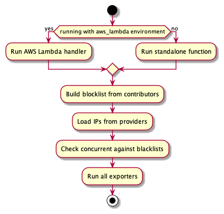

monitor
===

Code to run the blocklist check.

## Workflow

## Configuration

| Env var                                | Default           | Description                                                                                                                                                                                           |
|:---------------------------------------|:------------------|:------------------------------------------------------------------------------------------------------------------------------------------------------------------------------------------------------|
| EXPORTER_TABLE_STDOUT_ENABLED          | false             | Enable stdout printing of all results                                                                                                                                                                 |
| EXPORTER_SUMMARY_STDOUT_ENABLED        | false             | Enable summary logging                                                                                                                                                                                |
| EXPORTER_PAGERDUTY_ENABLED             | false             | Enable pagerduty reporting for negative results                                                                                                                                                       |
| EXPORTER_PAGERDUTY_INTEGRATION_KEY     | empty             | Integration Key for generic webhook integration                                                                                                                                                       |
| EXPORTER_PAGERDUTY_SOURCE              | blocklist-monitor | Source identifier for pagerduty event                                                                                                                                                                 |
| IP_PROVIDER_SES_REGIONS                | eu-central-1      | Comma-separated list with ses regions to search for ips                                                                                                                                               |
| IP_PROVIDER_ENV_IPS                    | empty             | comma seperated list with additional ips to check                                                                                                                                                     |
| BLOCKLIST_CONTRIBUTOR_SILENCER_LISTS   | empty             | comma seperated list with lists to remove from checking                                                                                                                                               |
| BLOCKLIST_CONTRIBUTOR_ADDITIONAL_LISTS | empty             | comma seperated list with additional lists to check                                                                                                                                                   |
| ENVIRONMENT                            | local             | Environment to run, can be `standalone` or `aws_lambda`                                                                                                                                               |
| MAX_CLASSIFICATION                     | yellow            | Classification level that should be the maximal allowed to be treated as "not listed", for available options see [classification.go](./pkg/dns/classification.go), see also the [FAQ](../docs/FAQ.md) |

## Run/Build

See [Makefile](./Makefile) or `make help`.
